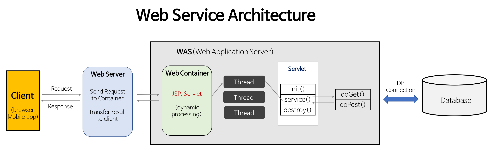

# 웹 ( Web )

### 브라우저 동작 과정 !
1. 주소창에 URL을 입력하고 Enter를 누르면, 서버에 요청이 전송됨
2. 해당 페이지에 존재하는 여러 자원들(text, image 등등)이 서버로부터 보내짐
3. 렌더링 엔진은 우선 HTML 파싱 과정을 시작함   
HTML 파서가 문서에 존재하는 어휘와 구문을 분석하면서 DOM 트리를 구축
    * DOM : 웹 브라우저가 이해할 수 있는 구조
4. 다음엔 CSS 파싱 과정 시작. CSS 파서가 모든 CSS 정보를 스타일 구조체로 생성
5. 이 2가지를 연결시켜 렌더 트리를 만듬. 렌더 트리를 통해 문서가 시각적 요소를 포함한 형태로 구성된 상태
6. 화면에 배치를 시작하고, UI 백엔드가 노드를 돌며 형상을 그림
7. 이때 빠른 브라우저 화면 표시를 위해 '배치와 그리는 과정'은 페이지 정보를 모두 받고 한꺼번에 진행되지 않음  
자원을 전송받으면, 기다리는 동시에 일부분 먼저 화면에 표시함

### 쿠키 ( Cookie ) vs 세션 ( Session )

|          | Cookie | Session |
|----------|--------|---------|
| 저장위치 | 클라이언트의 웹 브라우저가 지정하는 메모리 or 하드디스크 | 서버의 메모리  |
| 저장형식 | Text                                        | Object 
| 만료시점 | 쿠키 저장시 만료일 설정 <blockquote>Ex) 설정 없으면 브라우저 종료 시   | 정확한 시점 모름 <blockquote>Ex) 클라이언트가 로그아웃 시 or 설정시간 동안 반응이 없을 때 |
| 리소스   | 클라이언트의 리소스                              | 서버의 리소스 |
| 용량제한 | 한 도메인 당 20개, 한 쿠키당 4KB                  | 제한없음    |

#### 쿠키와 세션의 보안성?

* 쿠키는 클라이언트PC에 저장되기 때문에 다른 사용자에 의해서 임의로 변경이 가능해 보안이 낮다.
* 보안성을 높히려면 쿠키보다 세션에 저장해야하는데 세션에 저장하면 Server의 메모리를 과도하게 사용해서 무리
* 그래서 JWT 같은 토큰 라이브러리가 나온 것 !

### REST, REST API, RESTful
* 등장 배경?
    * 웹과 같은 하이퍼미디어 시스템을 위한 소프트웨어 아키텍처로 로이 필딩(Roy Fielding)이 제시
1. REST 개념
    * HTTP URI(Uniform Resource Identifier)를 통해 자원(Resource)을 명시하고,  
     HTTP Method(POST, GET, PUT, DELETE)를 통해   
     해당 자원에 대한 CRUD Operation을 적용해 메시지(Message)를 전달하는 것
2. REST API 개념
    * REST 기반으로 API를 구현한 것
3. RESTful 개념
    * RESTful은 일반적으로 REST라는 아키텍처를 구현하는 웹 서비스를 나타내기 위해 사용되는 용어이다.
    * ‘REST API’를 제공하는 웹 서비스를 ‘RESTful’하다고 할 수 있다.
* 가장 큰 장점 ! ( HTTP + JSON )
    * 특정 언어나 기술에 종속 받지 않고 모든 플랫폼에 이용이 가능하다 ! ( Loosely Coupling )
* 특징
    1. Uniform Interface
        * HTTP 표준만 맞는다면, 어떤 기술도 가능한 Interface 스타일
            1. Self-descriptive 
                * 서버나 클라이언트가 변경되더라도 오고가는 메시지는 언제나 self-descriptive 하므로 응답 메시지로 언제나 해석이 가능해야함
            2. Hyperlink
                * Hyperlink를 통해 다음 상태로 전이되어야 한다는 HATEOAS(하테오스)를 만족해야한다.
    2. Stateless (무상태)
        * 즉, HTTP Session과 같은 컨텍스트 저장소에 상태 정보를 저장하지 않는다
        * 따라서, 들어온 Request만 Message로 처리하면되고, 컨텍스트 정보를 신경쓰지 않아도 되어 구현이 단순해진다.
    3. Client-Server 아키텍쳐

### Static Pages vs Dynamic Pages

* Static Pages - 바뀌지 않는 페이지 -> 웹 서버는 파일 경로 이름을 받고, 경로와 일치하는 File 컨텐츠를 반환함  
    -> 항상 동일한 페이지를 반환함 ( image, html, css, javascript 등등 컴퓨터에 저장된 파일 )
* Dynamic Pages - 인자에 따라 바뀌는 페이지 -> 인자의 내용에 맞게 동적인 컨텐츠를 반환함  
-> WAS 서버에 의해 실행되는 프로그램을 통해 만들어진 결과물 ( Servlet: WAS위에서 돌아가는 자바 프로그램 )

### Web Server vs WAS 
#### Web Server (웹 서버)
* 하드웨어적 개념: Web 서버가 설치되어 있는 컴퓨터
* 소프트웨어적 개념: 웹 브라우저로부터 HTTP 요청을 받고, 정적인 컨텐츠( html, css )를 제공하는 서버
* 기능: 정적 컨텐츠 제공 + 클라 요청을 WAS로 보내고, WAS에서 처리한 결과를 클라에게 다시 전달하는 역할
* Ex) Apache, Nginx 등등
#### WAS ( Web Application Server )
* DB조회 및 다양한 로직 처리 요구시 동적인 컨텐츠를 제공하기 위해 만들어진 어플리케이션 서버
* WAS는 웹 컨테이너 or 서블릿 컨테이너라고도 불림 -> WAS = 웹 서버 + 웹 컨테이너
    * 컨테이너란 Jsp, Servlet을 실행 시킬 수 있는 소프트웨어 즉, WAS는 Jsp, Servlet 구동 환경을 제공
* Ex) Tomcat, JBoss 등

#### 웹 서버가 필요한 이유
* 웹 서버에서는 정적인 컨텐츠만 처리하도록 기능을 분배해 서버의 부담을 줄이는 것

#### WAS가 필요한 이유
* WAS는 DB 조회, 다양한 로직을 처리하는데 집중 시키기 위해  
따라서, 웹 서버를 WAS 앞에 두고, 필요한 WAS들을 웹 서버에 플러그인 형태로 설정하면 효율적인 분산 처리 가능 


### URI vs URL
* URI
    * 인터넷의 자원을 식별해주는 유일한 주소
* URL
    * 서버에 있는 자원의 위치를 나타냄